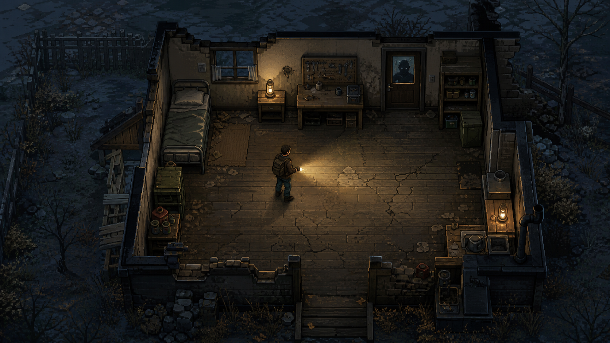
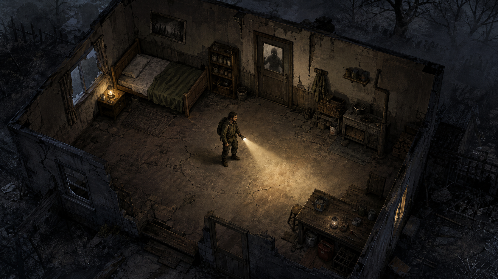
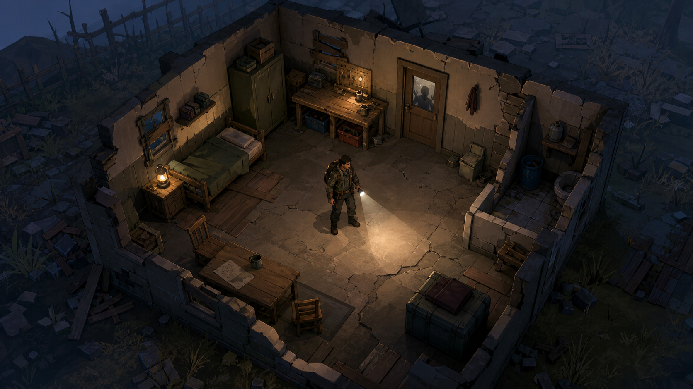

# Dead Signal 美术 / 音频资产审计与视觉方向样张

- 日期：2026-07-20
- 范围：审计现状、定义生产边界、制作概念样张，并记录 2026-07-20 确认的统一 faux-iso 改造决策。
- 前置调研：[2026-07-04-art-feasibility.md](2026-07-04-art-feasibility.md)
- 样张性质：方向选择用概念图，不是可直接切图入库的最终游戏资产。

> 2026-07-21 收口：本文第 2 节的“音频为 0”是立项时快照，现已由 `godot/assets/audio/` 的 7 首音乐、5 条环境循环和 66 个音效变体补齐；运行时优先读取正式 WAV，程序合成仅作缺失兜底。

## 1. 结论

项目已经有一套稳定的 faux-iso 视觉骨架：统一世界投影、8 方向像素角色、正式世界材质与营地道具、昼夜染色、视野遮暗、131 张 32×32 物品图标和 13 张写实肖像。后续重点不是继续堆零散图片，而是补齐以下生产系统：

1. 世界环境母版：地面、墙体、门、家具、废墟的统一材质语言。
2. 角色表现母版：幸存者、丧尸、劫掠者、狗，以及持械、受伤、睡眠、死亡等状态。
3. 音频骨架：音乐、环境、音效、UI 总线和状态切换。
4. 资产治理：来源、许可、尺寸、锚点、生成记录、验收状态和运行时引用的单一清单。

具名角色已按用户 authored 外貌制作 8 方向图集并接入运行时；用户将在后续统一实机验收比例、辨识度与同屏观感。

**本轮世界资产按 A“阴郁像素 + 强光影”执行。** A 与现有 32×32 图标、最近邻过滤和个人开发规模最相容；B、C 样张继续保留作历史对比，不进入当前运行时。

## 2. 当前资产盘点

### 2.1 已有资产

| 类别 | 数量 / 规格 | 来源与许可 | 当前用途 | 判断 |
|---|---:|---|---|---|
| 物品图标 | 131 张 PNG，32×32 | game-icons.net，按 CC BY 3.0 处理 | 库存、医疗等 UI | 可继续使用；需要保留署名和同一色板 |
| 幸存者肖像 | 13 张 PNG，365×564 RGBA | OpenGameArt，CC0 | 按角色 id 稳定映射 | 可作占位；不具备 authored 角色身份一致性 |
| 世界视觉 | 无纹理图集 | `IsoTilePanel` / `Polygon2D` 程序绘制 | 营地、探索关占位 | 逻辑可用，正式材质语言缺失 |
| 角色视觉 | 泛用 4×8 + 具名 4×8/3×8 + 布鲁斯 1×8，64×96/格 | OpenAI image generation，项目原创 | 7 名具名幸存者、布鲁斯、泛用幸存者/劫掠者/普通丧尸/犬类；武器/阵营/受击/血条仍程序叠加 | 已正式替换站立表现；全体人类使用现实头身比，睡眠帧暂保留矢量回退，待统一实机验收 |
| 营地道具 | 4×4 图集，96×96/格 | OpenAI image generation，项目原创 | 工作台、收音机、柜体、草垛、座椅、沙袋、床等 authored 道具外观 | 仅覆盖表现，原碰撞/导航/掩体/容器语义不变 |
| 装备纸娃娃 | 手持 4 张 96×96/格图集 + 人类穿戴 7 张 + 狗装备 2 张 | OpenAI image generation，项目原创 | 27 件非天然攻击武器、手电/火把、33 件人类穿戴、5 件布鲁斯装备 | 真实左右手/双手/双持/背向遮挡、11 槽穿戴与狗身体/头部槽均已接入；改装件独立外观另案 |
| 光照 / 可见性 | 程序系统 | `CanvasModulate`、`VisionMask`、光照逻辑 | 昼夜染色、遮暗、视野 | 规则骨架已有；缺正式灯光材质和全屏后处理 |
| 世界材质母版 | 1024×1024 灰度无缝纹理 + 4×4 RGBA 环境细节图集 | OpenAI image generation，项目原创 | `IsoTilePanel` 顶面/立面材质与地表细节 | 已接入营地和全部探索关；待统一实机验收密度与对比度 |
| 音乐 / 环境 / 音效 | 0 | 无 | 无 | 完整缺口 |

现有署名文件：

- `godot/assets/items/CREDITS.md`
- `godot/assets/portraits/CREDITS.md`

### 2.2 运行时表现骨架

- 营地使用 cartesian 逻辑坐标，经 `Iso.Project` 投到 faux-iso 视觉层。
- 营地与常规探索关统一使用 faux-iso 表现；玩法、物理、寻路、碰撞、噪音和视野判定仍使用连续 cartesian 坐标。
- `ActorSprite` 把连续朝向量化到 8 方向图集；具名角色和布鲁斯优先使用 authored 图集，缺图才回退泛用图集/程序矢量。
- `EquipmentVisualCatalog` 是装备表现单一登记入口：图集行、绘制层和改装变体回落不散写在角色绘制代码中；装备变化进入重绘脏标记。
- Wiki 护甲表 33 件人类穿戴和布鲁斯 5 件装备直接从真实槽态叠加；成对鞋/手套逐侧显示。面具/眼镜用低于发际线的面部锚点，板甲覆盖躯干与腿但不画手脚，口袋狗衣是两侧袋组挂具。
- 物品图标使用最近邻过滤，32×32 规格已形成事实标准。
- 项目中没有 `AnimatedSprite2D`、`SpriteFrames`、`Skeleton2D`、`TileMap` 资产管线。
- 项目中没有 `AudioStreamPlayer`、音频资源或 audio bus 布局。
- 正式世界材质位于 `godot/assets/world/`；生成 prompt、后处理和用途记录在该目录 `README.md`。

### 2.3 已决策：世界统一 faux-iso

2026-07-20 已确认营地与探索关全部使用 faux-iso。正式角色管线因此只维护一套世界投影和脚点/YSort 规则：

- `ActorSprite`、状态图标、路径、噪音提示和视野遮罩共享同一投影。
- 玩法坐标不随美术投影迁移，避免重做碰撞、导航与 authored 关卡坐标。
- 后续无论选择程序矢量、骨骼切片或预渲染多方向，都只需生产一套角色素材。

8 方向、64×96 单格、底部中心脚点已成为正式站立资产标准；人类统一现实人体比例，不用大头/chibi 提升辨识度。

## 3. 三套视觉方向

三张图使用同一内容：破损乡间房屋、床、工作台、实用物资、一名持手电幸存者，以及门后一个只作为威胁轮廓的普通丧尸。没有使用具名角色或新增剧情事件。

### A. 阴郁像素 + 强光影



**优点**

- 与现有 32×32 图标、最近邻过滤天然兼容。
- 轮廓清楚，缩放和低分辨率下仍可读。
- 购买成套 tileset、角色生成包和人工修帧的市场最成熟。
- Codex 能可靠检查格子、帧尺寸、色板、锚点和透明边。

**成本 / 风险**

- 这张样图细节密度高于实际 32×32 人物生产规格，不能直接当成“AI 已经能输出最终像素动画”的证明。
- 若要保留自由角度朝向，应继续用程序化矢量/骨骼，或将角色离散为至少 8 个方向；两者要通过竖切比较。

**适合**：尽快做出一致、可维护、能跑完整流程的个人项目版本。

### B. 炭笔手绘 + 剪纸骨骼



**优点**

- 氛围、材质和剧情承载力最高。
- 与已有写实肖像比像素路线更接近。
- 可把 AI 限制在静态层，动画由切分肢体和 Godot 骨骼承担。

**成本 / 风险**

- 每名角色需要稳定的身体切分、遮挡顺序、装备锚点和受伤状态。
- 11 个服装槽如果全部可视化，会产生不可接受的组合爆炸；竖切阶段只能表现“大轮廓服装 + 头部 + 手持武器”。
- 营地与探索的两种投影可能需要两套姿态母版。
- 场景细节越丰富，批量生成后的风格漂移和人工修整量越大。

**适合**：愿意接受更长美术周期，以氛围和角色表演作为核心卖点。

### C. 低模 3D 预渲染 + 手绘贴图



**优点**

- 多角度、动画、光照、角色比例和装备锚点最稳定。
- 同一角色可以批量渲染营地与探索所需角度。
- AI 可用于概念图和贴图草稿，真正的一致性由模型与动画保证。

**成本 / 风险**

- 必须引入 Blender、模型、绑定、动画、渲染和贴图资产治理。
- 前期学习和工具建设最重；若只做个人项目，容易把时间耗在管线而不是游戏本身。

**适合**：已经愿意学习 3D，或未来需要大量角色、装备和多角度动画时。

### 3.1 比较结论

| 指标 | A 像素 | B 手绘剪纸 | C 预渲染低模 |
|---|---:|---:|---:|
| 当前项目兼容度 | 5/5 | 3/5 | 2/5 |
| 静态画面上限 | 3/5 | 5/5 | 4/5 |
| 动画一致性 | 3/5 | 3/5 | 5/5 |
| Codex 自动化空间 | 5/5 | 4/5 | 4/5 |
| 个人开发交付风险 | 低 | 中高 | 高 |
| 推荐用途 | 第一版正式生产 | 氛围上限原型 | 长期备选 |

评分表达当前仓库的迁移成本，不是对媒介本身的普遍排名。

## 4. 建议的可运行竖切

选方向后，只生产以下最小集合：

### 世界

- 一间营地房间：地板、破墙、完整墙、门、窗。
- 床、工作台、储物架、固定灯各一件。
- 一套冷夜色、暖灯光、手电锥和视野遮暗组合。

### 角色

- 一名匿名幸存者母版，不绑定 authored 角色身份。
- 一只普通丧尸母版，不生成具名精英预设。
- 状态仅覆盖：站立、移动、持械/持灯、受击、倒地。
- 服装仅覆盖基础身体、大轮廓外套/护甲、头部、手持物四层；暂不把 11 个逻辑槽逐槽可视化。

### UI

- 继续复用现有 32×32 图标，不在竖切中重画 131 张。
- 只验证图标、角色、场景在同一色调后处理下是否冲突。

### 验收门槛

- 两种投影下角色脚点不漂。
- 转向、移动、持械时装备锚点不跳。
- 暗处仍能区分己方、中立、敌对轮廓。
- 手电、门后遮挡和视野遮暗不泄露目标。
- 100% 与常用缩放倍率下无插值发糊。
- 不改任何战斗、噪音、视野或寻路规则。

## 5. 音频生产规格（第一版）

当前音频是完全空白，因此先建系统再采购/生成大量声音。

### 5.1 总线

```text
Master
├── Music
├── Ambient
├── SFX
│   ├── Combat
│   ├── Foley
│   └── World
└── UI
```

- `Music`：营地、探索、威胁、战斗的音乐层。
- `Ambient`：风、雨、室内底噪、远处丧尸等长循环。
- `Combat`：枪、近战、受击、护甲格挡。
- `Foley`：脚步、衣料、门、床、工作台。
- `World`：火焰、电台、发电机等空间声源。
- `UI`：按钮、确认、警告和状态反馈。

### 5.2 第一批最小声音集合

- 4 个音乐状态：营地低压、探索低威胁、危险升高、战斗。
- 3 个环境循环：室外夜晚、破屋室内、风雨/恶劣天气。
- 5 组高频随机池：脚步、门、近战命中、丧尸声音、UI。
- 枪声按武器族先做短/中/长枪、霰弹四组，不按每把枪单独制作。

### 5.3 技术约束

- 音乐和环境长循环优先 OGG；需要精确短延迟的音效优先 WAV。
- 每个循环文件记录循环点，并检查首尾波形、直流偏移和爆音。
- 同组高频音效至少 3 个变体，运行时随机音量和轻微随机音高。
- Master 必须留峰值余量；具体响度只作为拟定值，完成第一轮实机混音后再锁定。
- 原始母带与游戏压缩文件分开保存；仓库只引用明确的游戏版文件。

## 6. 资产治理清单

正式引入任何素材时至少登记：

| 字段 | 说明 |
|---|---|
| `asset_id` | 稳定内部标识 |
| `kind` | environment / character / portrait / icon / music / ambient / sfx |
| `source_path` | 原始母版位置 |
| `runtime_path` | Godot 实际引用位置 |
| `source_url` | 商店、作者或生成工具页面 |
| `author` | 作者 / 供应方 |
| `license` | 精确许可名称和版本 |
| `proof` | 购买凭证或条款快照 |
| `generated_with` | 生成工具与模型；非生成资产留空 |
| `prompt_record` | 提示词 / 参考图记录位置 |
| `dimensions` | 尺寸、帧数、方向数 |
| `anchor` | 脚点、手部、武器等锚点 |
| `status` | concept / approved-master / runtime / retired |

禁止把“能下载”当成“可商用”，也禁止用来源不明的图片训练项目风格模型。具名角色、剧情关系和精英丧尸只根据用户批准的 authored 母版生成表现变体，不由生成工具补设定。

## 7. 本次样张生成记录

- 工具：Codex 内置 `imagegen`，默认内置工具路径。
- 输出：三张 1672×941 PNG。
- 输入图：无。
- 共同构图：相同的破损避难所、匿名幸存者、门后普通丧尸轮廓。
- 共同限制：无文字、无商标、无水印、不使用具名角色、不新增剧情事件、不过度血腥。
- 差异变量：A 为真实像素簇与限色；B 为炭笔/干刷/纸张质感与剪纸分层；C 为低模几何、手绘贴图与正交预渲染。

完整提示词保存在同目录的 [README.md](assets/2026-07-20-visual-directions/README.md)。

## 8. 下一决策

用户只需在 A / B / C 中选择一个方向进入竖切。选择的是“接下来验证哪条生产线”，不是永久放弃另两条；竖切未通过时可以退回当前程序化视觉，不影响玩法代码。
